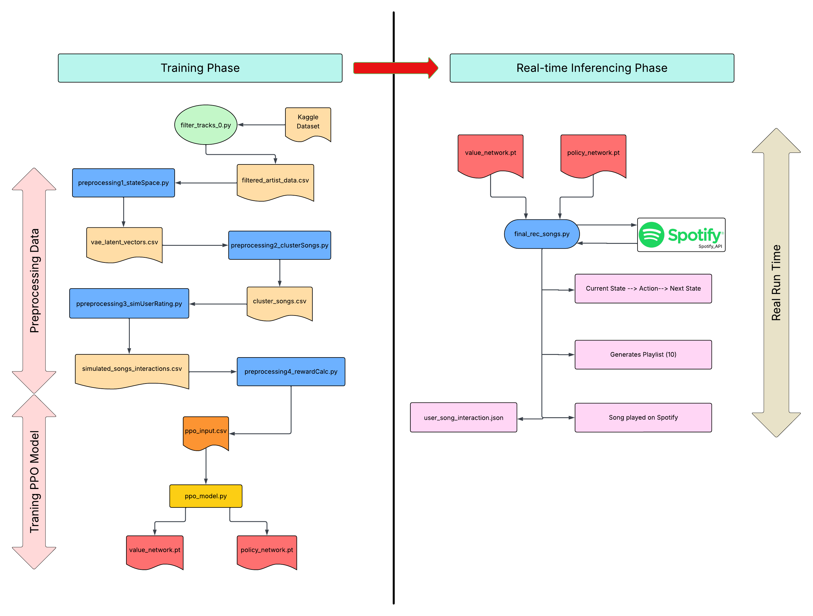
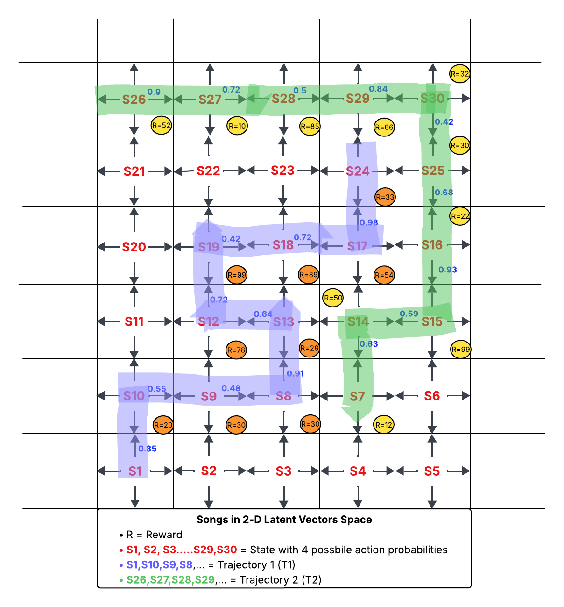

# AI-Project
Adaptive Spotify Music Recommendation using Reinforcement Learning

## Project Description

This project implements a music recommendation system using the **Proximal Policy Optimization (PPO)** algorithm with an **Actor-Critic Architecture**. During the inference phase, it recommends songs based on the policy learned during training and plays them automatically on Spotify app. As the user interacts with the environment by listening to songs, real-time feedback (percentage listened and song was liked or not) is captured and stored. This feedback is intended to be used for future training or fine-tuning of the Actor-Critic model to better adapt to the users musical preferences. The feedback-based fine-tuning is not implemented in this version and is left as a direction for future work.

In the context of music recommendation systems, the platform is faced with the challenge of selecting from millions of available songs. Each song represents a potential action the system can take, resulting in an extremely large action space. Furthermore, user behavior is inherently uncertain; musical preferences are deeply personal, dynamic, and often unpredictable. There is no deterministic rule for determining whether a user will enjoy a particular song. As a result, the system must continuously learn from user interactions and listening history to improve future recommendations.

This shifts the problem from a simple, static prediction task to a sequential decision-making problem that demands ongoing learning and adaptation. The agent must recommend songs, observe user feedback and refine its strategy over time. However, given the vastness of the action space, it is computationally infeasible to explore or store explicit information about every possible state-action pair.

To address these challenges, we adopt a **Deep Reinforcement Learning** approach using Proximal Policy Optimization (PPO). Here, neural networks enable the agent to learn compact representations of states and policies, allowing it to make informed recommendations based on learned parameters rather than exhaustive search.

---
## Related Solutions

Traditional recommendation methods, such as collaborative filtering, have been widely used to model user-item interactions. But these methods usually treat each recommendation as a single guess, without thinking about the order of what the user listened to before.  
Recent works have introduced reinforcement learning (RL) techniques to address these limitations:

1. **Deep Q-Network (DQN) with Simulated Training**  
One study proposes the use of a Deep Q-Network (DQN) trained in a simulated playlist-generation environment. This approach allows the system to handle the large action space by learning from trial-and-error interactions in a safe, offline setting *(Tomasi et al., 2023)*. But DQN faces limitations when it comes to large action space or state space.

2. **List-wise Recommendations via MDP and Online Simulation**  
Another work models the recommendation process as a Markov Decision Process (MDP), where:  
- Each moment of interaction is a state,  
- Recommending something is an action,  
- And the user’s reaction (e.g: click, skip) is the reward.  
Similar to the DQN-based method, this approach uses an online environment simulator to pre-train and evaluate the model.  
*(Zhao et al., 2018)*

3. **Continuous Action Space with DDPG (Deep Deterministic Policy Gradient)**  
A third approach leverages DDPG, a type of reinforcement learning designed for continuous action spaces. Rather than selecting songs by Id, this method represents each song using continuous features such as tempo, energy, or mood. This allows the system to handle a much larger number of song options while still providing accurate and varied recommendations.  
*(Qian, Zhao, & Wang, 2019)*

4. **Proximal policy optimization based hybrid recommender systems for large scale recommendations**  
This work proposes a switching hybrid recommender system that combines Proximal Policy Optimization (PPO) with autoencoder-based content filtering to address scalability and cold-start challenges. PPO’s actor-critic architecture effectively handles large action spaces and reduces policy gradient variance. The proposed method outperforms baseline models on the Movielens datasets across multiple evaluation metrics, demonstrating significant gains in recommendation precision and recall.*(Vaibhav Padhye et al., 2022)*

---
## Problem Formulation

We model the problem as a **Partially Observable Markov Decision Process (POMDP)**, where the agent does not have full access to the state of the environment, such as a user's preferences or listening context. Instead, it must make decisions based on partial observations and indirect feedback.

In reinforcement learning, an agent interacts with an environment over a sequence of time steps. At each time step 
𝑡, the agent selects an action **𝑎<sub>t</sub> ∈ 𝐴** based on its current state **𝑠<sub>t</sub> ∈ 𝑆**, following a policy **𝜋: 𝑆 → 𝐴**. After executing the action, it receives a **reward 𝑟<sub>t</sub> :𝑆 × 𝐴 → 𝑅** and transitions to the **next state S<sub>t+1</sub>**. The objective is to learn a policy that maximizes the expected cumulative reward.

To achieve this, we will be using **Proximal Policy Optimization (PPO)** a **policy-gradient algorithm** that enables stable learning in high-dimensional and continuous state spaces.

---
## Mathematical Description
## States Space:

The state space is represented by a latent vector derived from audio features and metadata of individual tracks. These **latent vectors** are learned using a **Variational Autoencoder (VAE)**, which compresses high-dimensional audio feature data (11-D) into a lower-dimensional embedding space (5-D). This latent representation captures the essential characteristics of each song, enabling compact and meaningful state descriptions. The state space **𝑆** thus consists of all such latent vectors corresponding to the available tracks, where each vector serves as a unique, continuous representation of the musical content(audio feature). Since we have a cold-start problem, we cannot use a user-track interaction matrix for state space representation **[5]** and must instead rely on latent vector generation **[1]**.

Each state **𝑠 ∈ 𝑆** is a continuous-valued latent vector derived from the audio features of a song using a trained Variational Autoencoder (VAE): 

**S<sub>t</sub> ∈ 𝑅<sup>d</sup>** , where **𝑠<sub>t</sub>** = VAE<sub>encoder</sub> (𝑥<sub>t</sub>)

**x<sub>t</sub> ∈ 𝑅<sup>n</sup>** : vector of audio features for track 𝑡 (e.g., danceability, energy, valence, etc.)

**𝑑 ≪ n** : dimensionality of latent space (5)

## Action:

In our formulation, actions **𝑎<sub>t</sub> ∈ 𝐴 ⊆ 𝑅<sup>d</sup>** represent track recommendations made by the agent at each time step. Each action corresponds to the latent vector of a candidate track, embedded in a continuous space. These vectors are derived using a Variational Autoencoder (VAE) and normalized to lie within a bounded range (0–1). To learn the optimal policy, we train a policy network that outputs a probability distribution over the available actions (top 4 songs).

Where: 

**𝑎<sub>t</sub>** is the latent vector of the recommended track at time t,

**𝑑** is the dimensionality of the latent space learned by the VAE (5)

## Reward:

The reward  𝑟 represents the immediate feedback received by the agent as a consequence of executing an action **𝑎<sub>t</sub>** and transitioning from the current state **S<sub>t</sub>** to the next state **S<sub>t+1</sub>**. It may be positive (reward) or zero (penalty), depending on the quality of the action taken in the given context.

The reward for a given action is calculated as a combination of two components: the **Interaction Score** (user feedback) and the **Proximity Score** (closeness to centroid of its cluster), which are explained later in this report.

## Transition Probability:

The transition probability function **𝑇** defines the likelihood of the agent transitioning to the next state **S<sub>t+1</sub>**, given the current state **S<sub>t</sub>** and action **𝑎<sub>t</sub>**. 
Formally, this is expressed as:
**𝑃(S<sub>t+1</sub>∣S<sub>t</sub>,𝑎<sub>t</sub>)**

In classical reinforcement learning, a transition tensor can be constructed where each element represents:

<div align="center">
  <span style="font-size: 25px;">
    <strong>𝑃<sub>𝑠𝑎𝑠′</sub> = 𝑃(S<sub>t+1</sub> = S′ ∣ S<sub>t</sub> = S, 𝑎<sub>t</sub> = 𝑎)</strong>
  </span>
</div>


These transition probabilities model the environment’s dynamics and help the agent anticipate future outcomes of its actions. However, in our case, both the state **S<sub>t</sub>** ∈ **𝑅<sup>5</sup>** exist in a continuous latent space learned via a Variational Autoencoder (VAE). Instead of computing explicit transition probabilities, our policy network outputs a probability distribution over the top 4 nearest candidate songs, and the next state is determined by sampling an action from this distribution.

## Observations:

In your case, since user preferences (the true state) are hidden, observations represent implicit or explicit feedback from the user in response to a recommended track.
The observation function **𝑍** defines the probability of observing **O<sub>t</sub>** given that the system is in state **S<sub>t</sub>** and the agent took action 
**𝑎<sub>t</sub>:**

<div align="center">
  <span style="font-size: 25px;">
    <strong>𝑍(O<sub>t</sub>∣S<sub>t</sub>,𝑎<sub>t</sub>) = 𝑃(O<sub>t</sub>∣S<sub>t</sub>,𝑎<sub>t</sub>)</strong>
  </span>
</div>
Where:

**S<sub>t</sub>**: latent representation of the currently playing track.

**O<sub>t</sub>**: observation (e.g., feedback such as play, skip, like).

**𝑎<sub>t</sub>**: action (i.e., track recommendation).

---

## Solution Method

Our solution leverages **Deep Reinforcement Learning** using **Proximal Policy Optimization (PPO)**, which is an algorithm that trains both a policy network and a value network at the same time, improving them together throughout the learning process. We adopt an Actor-Critic architecture, where: 

- The actor represents the policy network which gives probability distrubtion over top 4 songs given the state.
- The critic estimates the value of the current state expected cumulative future reward starting from state **S<sub>t</sub>**. 

- **State Space**:  
Each state includes the currently playing song along with its features (such as tempo, energy, or genre), all represented in latent vector form.  

- **Action Space**:  
The action corresponds to selecting the next song from the available pool.

- **Reward**:
A score computed based on the users interaction with the song and its proximity to the cluster centroid.

---

## Solution Implementation

### Flowchart



### A. Training Phase

### Step 1. Filtering Kaggle Dataset
- First we filters tracks released between the years 2000 and 2020.
- Retains only songs by a predefined list of popular artists during those decades (e.g., Ed Sheeran, Taylor Swift, Drake).
- Stores the final filtered dataset (~2000 tracks) in `filtered_artist_data.csv` for downstream analysis.

### Step 2. State Representation
- Each song is originally represented in an 11-dimensional feature space (e.g., tempo, energy, etc.).
- To make the model more efficient, we use a Variational Autoencoder (VAE) to reduce this to a 5-D latent space.
- These compressed vectors become our state representations.
- All feature values are normalized to the range [0, 1].

### Step 3. Clustering Songs
- In our recommendation problem we don't have user-song interaction details ahead which leads to a cold start problem.
- The cold start problem is addressed using content-based filtering, with K-Means clustering applied to group similar tracks based on their features.
- This provides a meaningful way to identify related songs and offers a strong starting point for recommendations.
- Loads a 5-D latent vectors of songs represented by VAE-generated latent vectors in Step 2.
- Identifies latent feature columns to use as input for clustering.
- Applies K-Means clustering to group similar tracks into 20 clusters based on their latent space proximity.
- For each cluster, calculates the distance of each song to its cluster centroid and stores this information along with the assigned cluster ID for each track in the dataset.

### Step 4. Simulating user rating
- Since actual user-song interaction data is unavailable, we simulate interactions for training purposes.
- Each song is assigned a synthetic **`percentage_listened`** value and a binary **`liked`** flag (1 = liked, 0 = not liked).
- Working:
  - For each cluster, a mean and standard deviation are randomly sampled within reasonable bounds.
  - The `percentage_listened` score is generated using a Gaussian distribution specific to each cluster.
  - Scores are clipped to fall between [0,1].
  - Where 0 means user completely skipped the song, 0.5 - user listened the 50% of song, 1 - user listened the song completely and likewise for other values.
- A song is considered “liked” if the simulated `percentage_listened` value exceeds 0.6.
- This simulation approximates user preferences and enables offline training of the recommendation model in the absence of real feedback.

### Step 5. Reward Calculation for each states (songs)

- To generate a reward signal for each song to be used during PPO training we take both user interaction and song relevance.
- Reason for combining two scores:
  - Simulated user behavior (`percentage_listened` and `liked`) captures engagement, while proximity to cluster centroid measures how representative the song is within its group.
- Interaction Score is calculated by:
  - A weighted combination of `percentage_listened` and `liked` flags. This reflects how positively a user responds to a track.
- Proximity Score is calculated by:
  - For each cluster, the Euclidean distance from a song to the cluster centroid is calculated.
  - The proximity score is normalized within the cluster: closer songs receive higher scores (closer to 1), while outliers receives lower scores.
- Final Reward Calculation:
  - It is a weighted combination of the `interaction score` and `proximity score`. Which ensures that both user preference and content relevance influence the training signal.

### Step 6. Training PPO Model:
### PPO Model Architecture and Training Setup

### 1. Policy Network
- Takes a 5-D latent vector as input (from VAE).
- Outputs a softmax probability distribution over the top 4 most similar songs (actions), found using K-Nearest Neighbors (KNN).
- We ensures that no track is repeated within an episode and the last 3 selected songs are excluded to maintain playlist diversity.

```bash
Input: 5D latent vector

Layer (type)              Output Shape           Param #
-----------------------------------------------------------
Linear (fc1)              (128,)                 768       # 5×128 + 128
ReLU
Linear (fc2)              (128,)                 16,512    # 128×128 + 128
ReLU
Linear (fc3)              (4,)                   516       # 128×4 + 4
Softmax
-----------------------------------------------------------
Total Parameters:                               17,796
Trainable Params:                               17,796
```

### 2. Value Network
- Also receives the same 5D latent vector as input.
- Outputs a single scalar value estimating the expected cumulative reward from the current state.

```bash
Input: 5D latent vector

Layer (type)              Output Shape           Param #
-----------------------------------------------------------
Linear (fc1)              (128,)                 768       # 5×128 + 128
LeakyReLU
LayerNorm                 (128,)                 256       # 2×128 (weight + bias)

Linear (fc2)              (128,)                 16,512    # 128×128 + 128
LeakyReLU
LayerNorm                 (128,)                 256       # 2×128

Linear (fc3)              (1,)                   129       # 128×1 + 1
-----------------------------------------------------------
Total Parameters:                               17,921
Trainable Params:                               17,921
```

### 3. Advantage Function
- Measures how favorable an action was compared to the expected value of the state:


<div align="center">
  <span style="font-size: 25px;">
    <strong>A(S<sub>t</sub>,a<sub>t</sub>) = R<sub>t</sub> - V(S<sub>t</sub>)</strong>
  </span>
</div>
Where: 

**R<sub>t</sub>**: Actual return (or cumulative reward) obtained after taking action **a<sub>t</sub>** in state **S<sub>t</sub>**. It includes the immediate reward and discounted future rewards.

**V(S<sub>t</sub>)**: The estimated value of state **S<sub>t</sub>**, predicted by the Value Network. It reflects the agent’s expected reward from that state before taking any action.
- PPO uses this to reinforce actions that perform better than expected and suppress those that underperform.


### 4. Episode Configuration
- Each episode generates a playlist of 10 songs.
- The agent starts from a random track and sequentially selects the next 9 tracks using the policy network.
- Collects reward after each selection and updates its policy using PPO.
- Training hyperparameters : `lr` = 1e-4, `gamma` = 0.95, `clip_epsilon` = 0.1

---
## Songs in 2-D Gridworld



The above figure show how songs will appear when their high-dimensional latent representations are embedded into a 2D space for visualization. Each point represents a song (state), and transitions between them reflect the learned PPO policy.
- Each cell (S1 to S30) represents a song embedding in 2D latent space and create state space.
- At every song (state), the PPO policy chooses from the **top 4 songs** using KNN points which are close to current latent vectors.
- Arrows shows the action transitions with probabilities learned by the policy network.
- Two trajectories (T1 in `Purple`, T2 in `Green`) illustrates how the agent generates a 10-song playlist (Taking action based on policy learnt).
- Rewards (`R=...`) are assigned to songs based on user interaction and proximity to cluster centroids.
- PPO optimizes the policy by reinforcing paths that leads to **higher cumulative rewards**, guided by the advantage function.

A similar process applies to higher-dimensional state spaces, such as the 5D latent representations used in this project, where each state has 4 possible actions. This approach can be extended to even higher-dimensional spaces and larger action sets as needed.

---
## Features

- Real-time song playback via Spotify Web API
- Actor-Critic network trained using PPO for adaptive recommendations
- Feedback loop based on percentage listened and liked status
- Top-4 song selection using KNN over latent vectors
- Logs user interactions to retrain and fine-tune the model
- Episode-based policy improvement with live policy/value loss tracking
  
---
## Run Steps:
### Step 1. Spotify Premium Setup Instructions

Before running the real-time playlist recommender, you **must** have:

- A **Spotify Premium** account (required for playback control)
- Your own **Spotify API credentials** (Client ID & Client Secret)


#### Step-by-Step: Get Spotify Client ID & Secret

1. Go to [Spotify Developer Console](https://developer.spotify.com/documentation/web-api)
2. Log in with your Spotify Premium account.
3. Click your profile icon (top-right) → Select Dashboard.
4. Click "Create an App"
   - App Name: any name (e.g., `Playlist Recommender`)
   - App Description: e.g., `Real-time Spotify playlist generator using PPO`
   - Redirect URI:  
     ```
     http://127.0.0.1:8888/callback
     ```
   - Click Add, then click Save the app.

5. After saving:
   - Copy your Client ID
   - Click "View Client Secret" to copy the secret

#### Spotify API Used

```bash
user-modify-playback-state

user-read-playback-state

user-library-read
```
Ensure these scopes are enabled when authenticating via SpotifyOAuth (**Already added in program**).

---
### Step 2. Installation

Install my-project with npm
1. **Clone the repository:**
```bash
git clone https://github.com/KAUSTIKR/AI-Project
cd AI-Project/PPO_Music_RecSys
```

2. **Install dependencies:**
```bash
pip install -r requirements.txt
```
3. **Run the Recommendation Script:** <br>
NOTE: Replace <CLIENT_ID> and <CLIENT_SECRET> with your Spotify API credentials:

```bash
python final_rec_songs.py --client_id=<CLIENT_ID> --client_secret=<CLIENT_SECRET>
```
When running the program for the first time, you’ll be prompted to grant permission for playlist and playback access. Simply click “Agree” on the authorization screen to continue and enjoy your music recommended.

#### Interact with the System:
- The script will start playing songs.
- Your interactions (% listened and liked) are recorded in user_song_interactions.json in the current directory.

---

## Results
Looking at results:

**Current State(s) --> Actions(Top 4 songs) --> Next State(s')**
   
```bash 
Current song ID (state): 05S5yY7H0WuiQsEhrtjQj5
Top 4 recommended songs (actions) with probabilities:
  1. 72GBvm75IHjawz11FCcDma — Prob: 0.728
  2. 0PG9fbaaHFHfre2gUVo7AN — Prob: 0.239
  3. 7aBxcRw77817BrkdPChAGY — Prob: 0.017
  4. 4lJNen4SMTIJMahALc3DcB — Prob: 0.016
Selected next song (next state): 72GBvm75IHjawz11FCcDma
```
The displayed probabilities represent the policy learned by the model during the training phase.

**Generates Playlists (10 songs)**

```bash
Final Playlist
1. 05S5yY7H0WuiQsEhrtjQj5
2. 72GBvm75IHjawz11FCcDma
3. 6d1B1k4lvWNSu3LFlUw1Gj
4. 04zTmVio529e6gGh21Tcnb
5. 0ILEnJtqVXZZ5zyH12YIIc
6. 1NCSa6QvClPVe7KqsqjnMn
7. 6axMDyb9uCb30oXvVSlANp
8. 1L3NV7VrCiuE8C5QlhdeQL
9. 7GZCNHOruZsbNYIaPud5Lb
10. 2HOjSDwKRMq2NZ78aGewy2
```
The playlist generation begins with a starting track, such as `05S5yY7H0WuiQsEhrtjQj5`. Each time the program runs, a different starting track is randomly selected from the dataset, resulting in a unique playlist. All recommended tracks are then added to the Spotify app's playback queue.

**Logging Interactions**
 ```bash
Logging Interactions
Logged: 05S5yY7H0WuiQsEhrtjQj5 | 0.3 | liked: 0
Logged: 72GBvm75IHjawz11FCcDma | 1.0 | liked: 1
```
Logs for each track are stored in a JSON file and can be used later to fine-tune or update the learned policy.

---

## Dataset
Source: [Spotify Songs Dataset on Kaggle](https://www.kaggle.com/datasets/rodolfofigueroa/spotify-12m-songs)

---
## Acknowledgements

 - [Spotify](https://developer.spotify.com/documentation/web-api)
 - [OpenAI PPO Resources](https://spinningup.openai.com/en/latest/algorithms/ppo.html)
 - [37 Implementation Details of Proximal Policy Optimization](https://iclr-blog-track.github.io/2022/03/25/ppo-implementation-details/)
 - [PPO Implementation](https://www.youtube.com/watch?app=desktop&v=hlv79rcHws0)
 - [Proximal Policy Optimization (PPO) - Explained](https://www.youtube.com/watch?v=TjHH_--7l8g&t=37s)
 - [Deep RL class by huggingface](https://huggingface.co/blog/deep-rl-ppo)


## References
1. Qadeer Khan, Torsten Schön, Patrick Wenzel. *Latent Space Reinforcement Learning for Steering Angle Prediction*. [arXiv](https://arxiv.org/abs/1902.03765)
2. Nick Qian - Sophie Zhao - Yizhou Wang. (n.d.). *Spotify Reinforcement Learning Recommendation System*. [Link](https://sophieyanzhao.github.io/AC297r_2019_SpotifyRL/2019-12-14-Spotify-Reinforcement-Learning-Recommendation-System/)
3. Tomasi, F., Cauteruccio, J., Kanoria, S., Ciosek, K., Rinaldi, M., & Dai, Z. (2023, October 13). *Automatic Music Playlist Generation via simulation-based reinforcement learning*. [arXiv](https://arxiv.org/abs/2310.09123)
4. Zhao, X., Xia, L., Zhang, L., Ding, Z., Yin, D., & Tang, J. (2018). *Deep reinforcement learning for page-wise recommendations*. [DOI](https://doi.org/10.1145/3240323.3240374)
5. Vaibhav Padhye, Kailasam Lakshmanan, Amrita Chaturvedi. *Proximal policy optimization based hybrid recommender systems for large scale recommendations*. [DOI](https://doi.org/10.1007/s11042-022-14231-)
